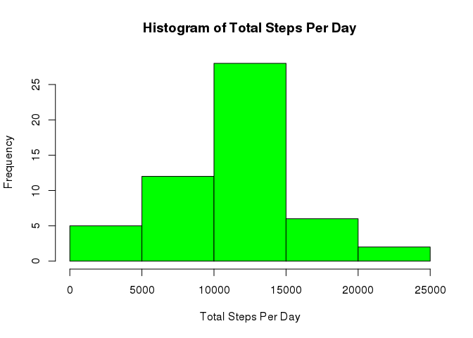
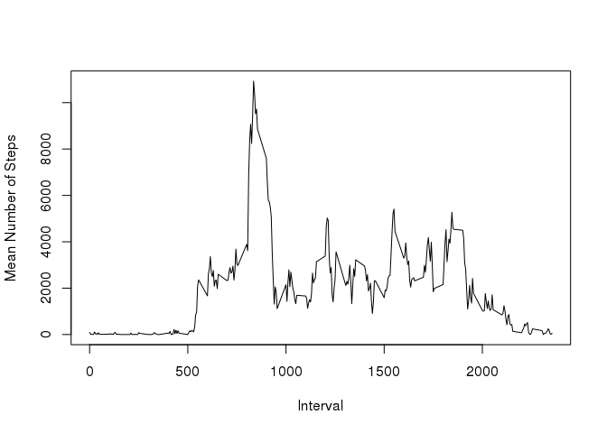
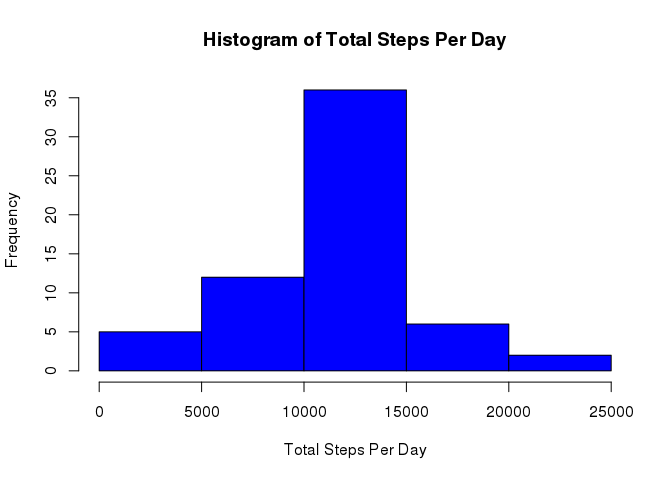
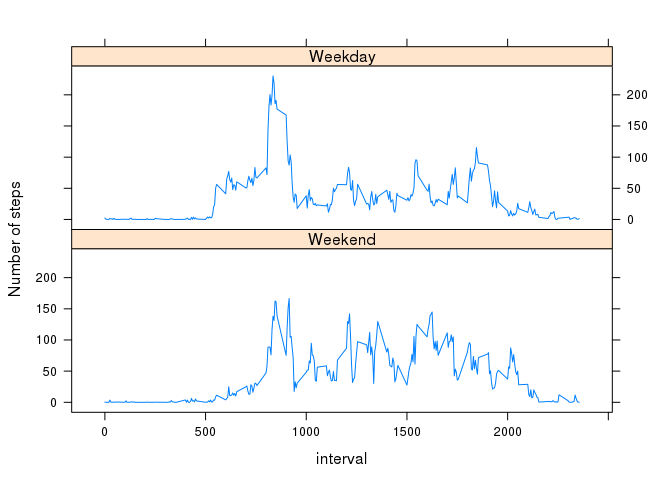

# Reproducible Research: Peer Assessment 1


## Loading and preprocessing the data

```r
# Assume data file is present in current directory as "activity.csv"
activityData <- read.csv("activity.csv", 
                         stringsAsFactors = FALSE)
activityData$date <- as.Date(activityData$date)
```

## What is mean total number of steps taken per day?

```r
stepsPerDay <- aggregate(steps ~ date, 
                         activityData, 
                         sum)
hist(stepsPerDay$steps, 
     col = "green", 
     main = "Histogram of Total Steps Per Day", 
     xlab = "Total Steps Per Day")
```

<!-- -->

```r
meanSteps <- mean(stepsPerDay$steps)
medianSteps <- median(stepsPerDay$steps)
```

#### The mean of total number of steps is 10766.19 

#### The median of total number of steps is 10765

## What is the average daily activity pattern?

```r
stepsPerInterval <- aggregate(steps ~ interval, 
                              activityData, 
                              sum)
plot(stepsPerInterval$interval, 
     stepsPerInterval$steps, 
     type = "l", 
     xlab = "Interval", 
     ylab = "Mean Number of Steps")
```

<!-- -->

```r
# Find out the logical vector indicating which interval has maximum steps
areStepsMax <- sapply(stepsPerInterval$steps, 
                      function(x) {
                        x == max(stepsPerInterval$steps)
                      } )
                        
maxStepsInterval <- stepsPerInterval$interval[which(areStepsMax)]
```

#### The max steps are in interval(s): 835


## Imputing missing values

```r
areValuesNa <- sapply(activityData$steps, 
                      function(x) is.na(x))
totalMissingValues <- length(which(areValuesNa))
```
#### Total number of missing values are 2304


```r
# Create a copy of activity data and impute missing value in new data. Use mean values for that interval to replace missing values
library(dplyr)
newActivityData <- activityData
meanStepsPerInterval <- aggregate(steps ~ interval, 
                                  activityData, 
                                  mean)
for (index in 1:nrow(activityData)) {
  if(is.na(activityData$steps[index])) {
    meanStepsThisInterval <- 
      dplyr::filter(meanStepsPerInterval,
                    interval == 
                      activityData$interval[index])$steps
    
    newActivityData$steps[index] =
      round(meanStepsThisInterval, 
            digit = 0)
  }
}

newStepsPerDay <- aggregate(steps ~ date, 
                            newActivityData, 
                            sum)
hist(newStepsPerDay$steps, 
     col = "blue", 
     main = "Histogram of Total Steps Per Day", 
     xlab = "Total Steps Per Day")
```

<!-- -->

```r
newMeanSteps <- mean(newStepsPerDay$steps)
newMedianSteps <- median(newStepsPerDay$steps)
```

#### The mean of total number of steps in imputed data is 10765.64 

#### The median of total number of steps in imputed data is 10762

#### The difference between mean of raw and imputed data is 0.55, which is not significant.

#### The difference between median of raw and imputed data is 3, which is not significant.


## Are there differences in activity patterns between weekdays and weekends?

```r
library(lattice)
weekendNames <- c('Saturday', 'Sunday')
newActivityData$dayType <- 
  factor((weekdays(newActivityData$date) 
          %in% weekendNames),
         levels = c(TRUE, FALSE), 
         labels=c('Weekend', 'Weekday'))

newStepsPerDayTypePerInterval <- 
  newActivityData %>% 
  group_by(dayType, interval) %>%
  summarise(meanSteps = mean(steps))

xyplot(meanSteps ~ interval | dayType, 
       data = newStepsPerDayTypePerInterval, 
       type="l", 
       layout = c(1,2), 
       ylab = "Number of steps")
```

<!-- -->

